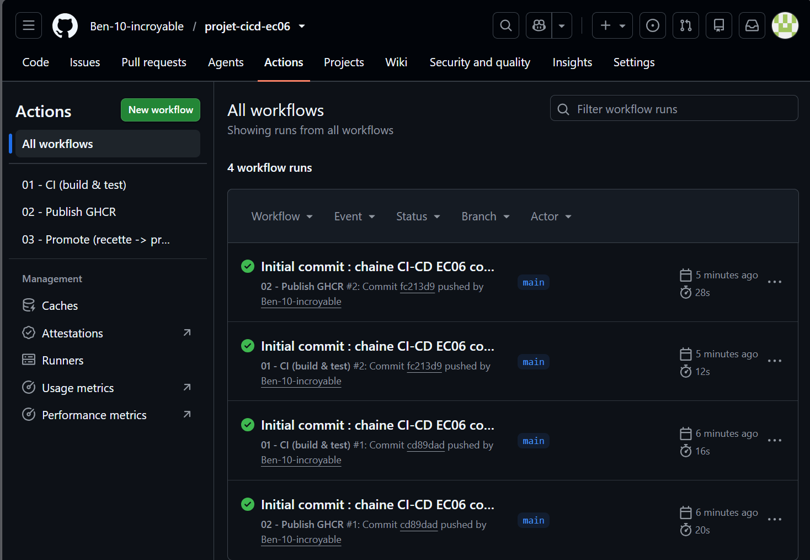
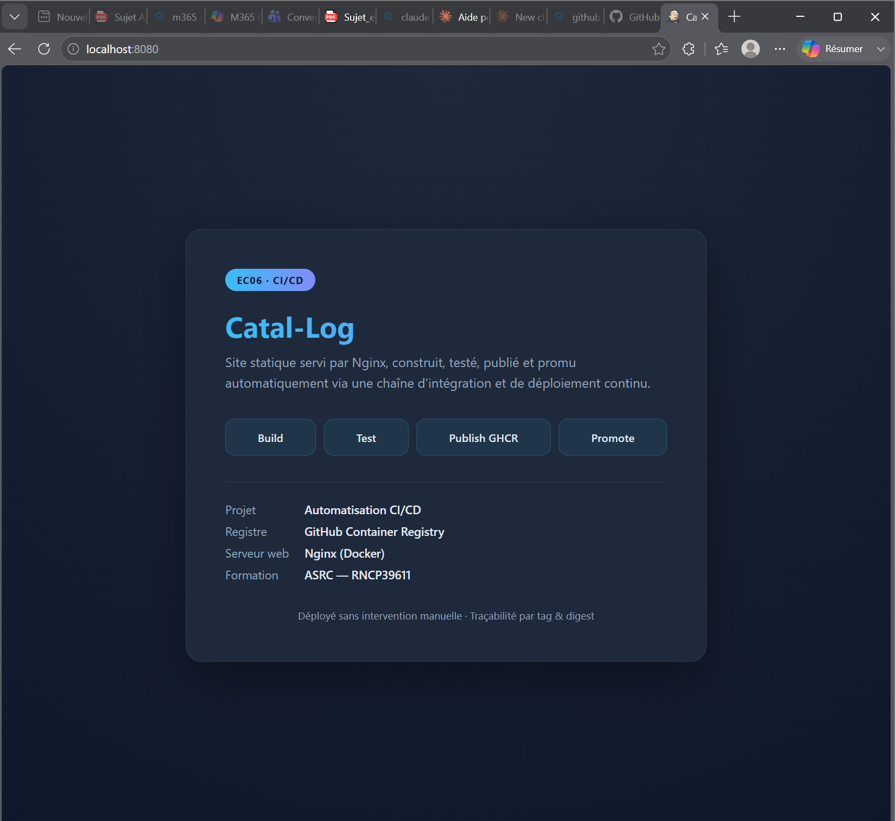
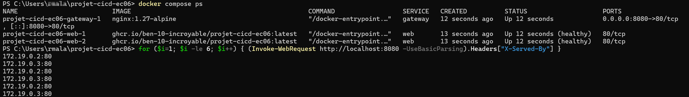

# 03 - Fiche tests

## Test automatisé GitHub Actions

- Workflow concerné : 01-ci.yml
- Lien vers le run réussi : https://github.com/Ben-10-incroyable/projet-cicd-ec06/actions (workflow "01 - CI (build & test)", run en succès)
- Ce qui est testé :
  - présence des fichiers obligatoires (index.html, version.json, Dockerfile) ;
  - validité du fichier version.json (JSON valide) ;
  - construction de l'image Docker ;
  - démarrage du conteneur et réponse HTTP 200 ;
  - présence du contenu attendu dans la page (mot "Catal-Log").
- Résultat : **réussi** (tous les runs 01-CI sont en succès).

>
> 

## Test local Docker ou Docker Compose

### Situation A - Test réalisé

Commandes utilisées :

docker build -t catal-log .
docker run -d -p 8080:80 --name test-site catal-log
# vérification sur http://localhost:8080 puis nettoyage
docker rm -f test-site

ou avec Compose :

docker compose up -d --scale web=2
docker compose ps
docker compose down

Résultat observé : le site s'affiche correctement sur http://localhost:8080 (HTTP 200). L'image se construit et le conteneur démarre sans erreur.

>
> 

## Simulation de scaling

docker compose up -d --scale web=2
docker compose ps

Résultat observé : 3 conteneurs Running (2 instances web + 1 gateway). En interrogeant plusieurs fois le point d'entrée, l'en-tête `X-Served-By` révèle deux adresses différentes (172.19.0.2 et 172.19.0.3) qui alternent : la charge est bien répartie entre les deux instances.

Commande de vérification (PowerShell) :

for ($i=1; $i -le 6; $i++) { (Invoke-WebRequest http://localhost:8080 -UseBasicParsing).Headers["X-Served-By"] }

>
> 

## Limites de la simulation

- Absence de vrai load balancer (simple round-robin DNS interne à Docker).
- Absence de haute disponibilité : un seul hôte, pas de tolérance à la panne d'un serveur.
- Absence de supervision et d'autoscaling automatique.
- Dépendance à l'environnement local (Docker Desktop).
- Pas d'auto-réparation multi-nœuds : Compose se limite à la politique restart locale.
