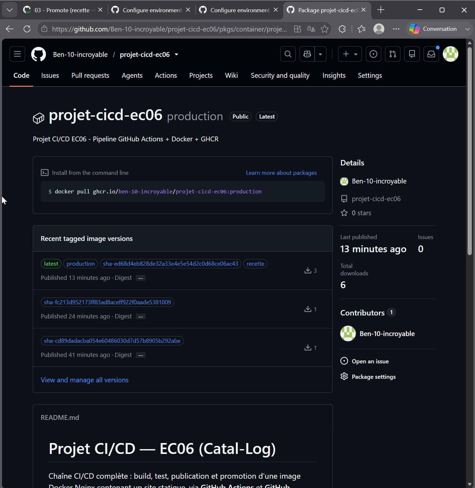
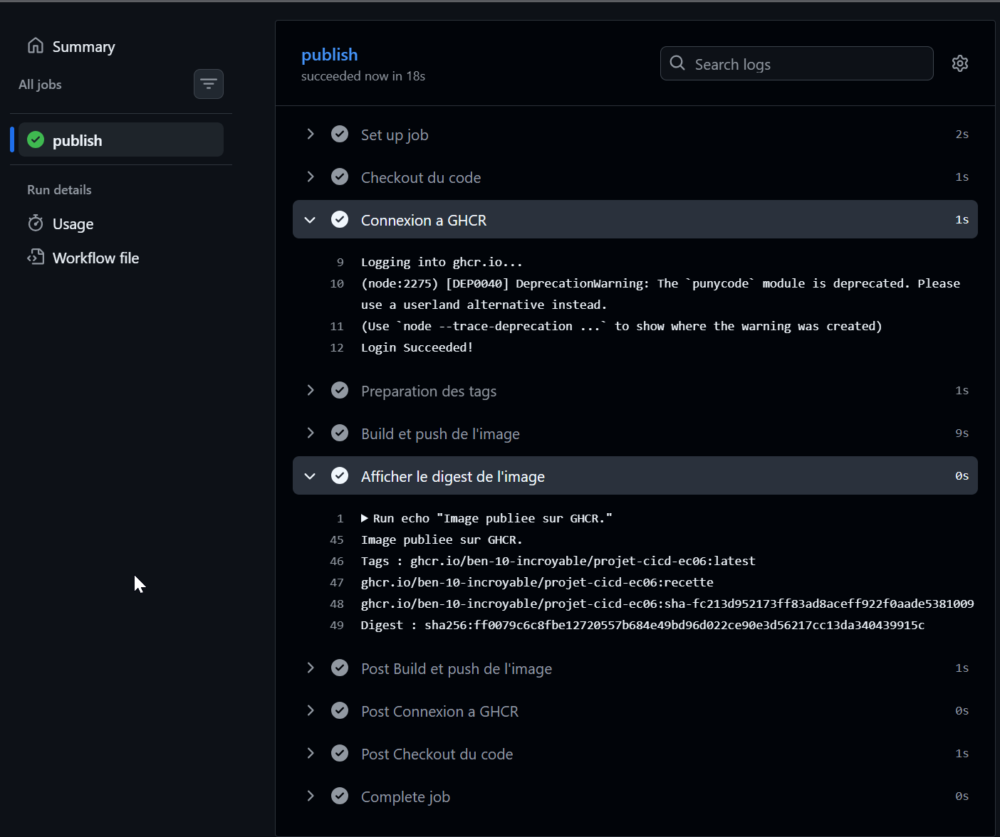

# 04 - Preuve image GHCR

## Image publiée

- Nom de l'image : ghcr.io/ben-10-incroyable/projet-cicd-ec06
- Tag principal : latest (également recette, production, sha-<commit>)
- Digest : sha256:9c37039c69da51da068ce87313d5bd68dd35fe190bf1066b7c55d3e32942e56e
- Lien GHCR : https://github.com/Ben-10-incroyable/projet-cicd-ec06/pkgs/container/projet-cicd-ec06

>
> 

>
> 

## Explication

Le **tag** est une étiquette lisible et mobile donnée à une image (`latest`, `recette`, `production`). Il facilite l'usage au quotidien mais peut être déplacé d'une image à une autre.

Le **digest** (`sha256:...`) est une empreinte calculée à partir du contenu exact de l'image. Il est unique et immuable : deux images identiques ont le même digest, et la moindre modification change le digest.

Pour la **traçabilité**, le digest identifie l'artefact de façon fiable : on sait précisément quelle image tourne. Pour le **rollback**, il suffit de re-cibler un digest antérieur connu et fonctionnel : on redéploie exactement la version précédente, sans reconstruction, ce qui rend le retour en arrière fiable et prévisible.
