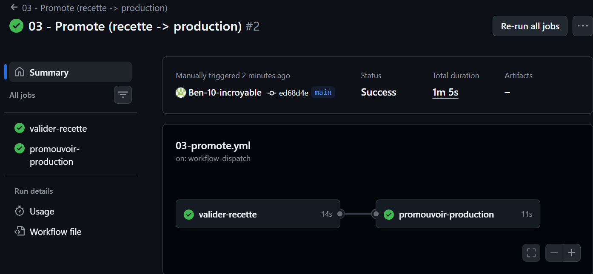

# 05 - Preuve recette simulée

## Workflow de validation recette

- Workflow concerné : 03-promote.yml (job `valider-recette`)
- Environnement GitHub : recette
- Tag source validé : recette
- Digest observé : sha256:9c37039c69da51da068ce87313d5bd68dd35fe190bf1066b7c55d3e32942e56e
- Lien du run : https://github.com/Ben-10-incroyable/projet-cicd-ec06/actions (workflow "03 - Promote", run #2)

## Résultat

Le job `valider-recette` tire l'image publiée sous le tag `recette`, la lance dans un conteneur puis effectue un test HTTP. Le code retourné est **200**, ce qui confirme que l'image candidate fonctionne avant d'être promue. Le job se termine en succès, autorisant le passage au job de promotion.

>
> 
