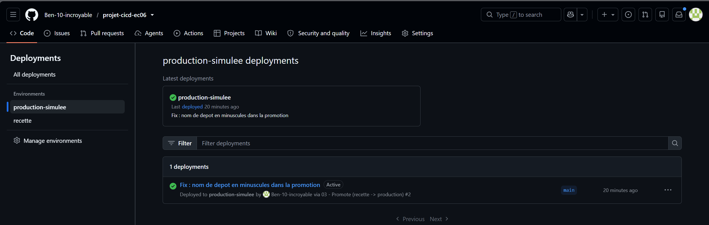
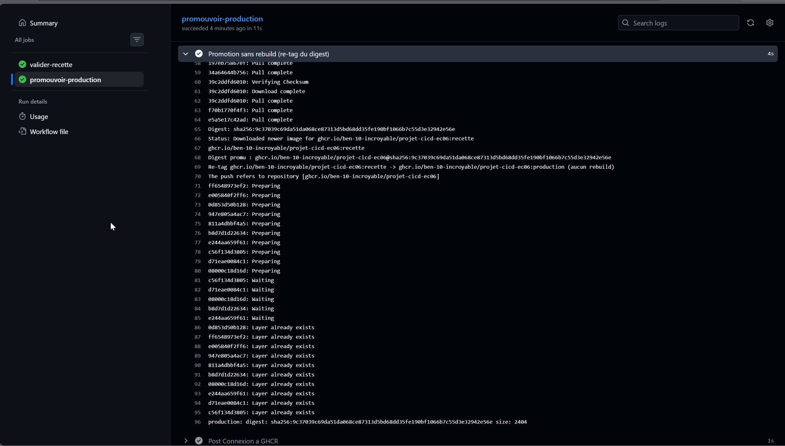

# 06 - Preuve promotion production-simulee

## Promotion

- Workflow concerné : 03-promote.yml (job `promouvoir-production`)
- Environnement GitHub : production-simulee
- Tag source : recette
- Tag cible : production
- Lien du run : https://github.com/Ben-10-incroyable/projet-cicd-ec06/actions (workflow "03 - Promote", run #2, Status Success)

Le passage en `production-simulee` est protégé par une approbation manuelle (Required reviewer). Le déploiement s'est mis en pause et a été approuvé manuellement avant de continuer.

>
> 

## Point essentiel

La promotion doit réutiliser une image existante. Elle ne doit pas reconstruire l'image.

Dans le workflow, le job de promotion effectue uniquement `docker pull` (récupération de l'image recette), `docker tag` (re-étiquetage en production) puis `docker push`. Il n'y a **aucun `docker build`** : c'est le même artefact qui reçoit un nouveau tag.

## Preuve

La preuve d'absence de rebuild repose sur trois éléments visibles dans le log du job `promouvoir-production` :

1. Le **digest de la source (recette)** et celui de la **cible (production)** sont **identiques** :
   `sha256:9c37039c69da51da068ce87313d5bd68dd35fe190bf1066b7c55d3e32942e56e`.
2. Le log affiche explicitement la mention **« (aucun rebuild) »** lors du re-tag.
3. Au moment du push, toutes les couches indiquent **« Layer already exists »** : aucune couche n'est reconstruite ni renvoyée, seul un nouveau tag est enregistré.

De plus, sur GHCR, une **seule version d'image** porte à la fois les tags `recette` et `production` : c'est bien le même artefact.

>
> 
